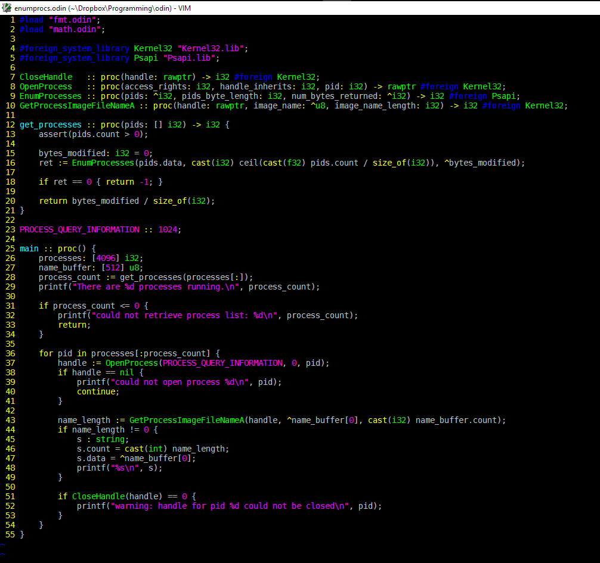

# Odin.vim
Syntax highlighting for [Ginger Bill's](https://www.youtube.com/user/GingerGames) programming language, Odin.
Derived from [jansedivy's jai.vim](https://github.com/jansedivy/jai.vim).

### What it looks like. (In cmd.exe, anyway.)

### Installation

Simply clone the repository into your Vim's package directory. (Vim must be installed from https://www.vim.org.)
If using [Pathogen](https://github.com/tpope/vim-pathogen), clone it into the `bundle` folder within Vim's package directory, instead.

Note that the package directory is located in `%USERPROFILE%\vimfiles` on Windows,
and `~/.vim` on Unix.